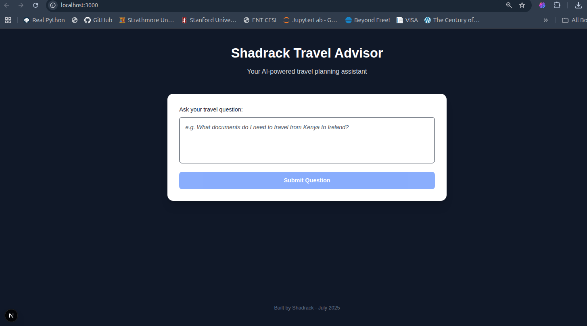

# Travel Assistant AI ✈️

A full-stack AI-powered assistant that helps users with travel-related queries like visa requirements, passport rules, travel advisories, and more — using **FastAPI**, **Next.js**, **TailwindCSS**, and **Gemini LLM**.

---

## Features

- Ask natural language travel questions (e.g. _“What documents do I need to travel from Kenya to Ireland?”_)
- LLM-powered answers from Gemini (Google AI)
- Real-time responses with clean UI
- Built with:
  -  FastAPI (Python backend)
  -  Next.js (React frontend)
  -  TailwindCSS
  -  Gemini LLM (Free tier)
- BONUS: Local query history

---

##  Project Structure

```
travel-assistant/
│
├── backend/                # FastAPI backend
│   ├── app/
│   │   ├── api/routes.py
│   │   ├── schemas/query.py
│   │   ├── services/llm.py
│   │   ├──  main.py
│   │   ├──  list_models.py # to check best models to use.
│   │   └── __init__.py
│   ├── .env.template
│   ├── requirements.txt
│ 
│
├── frontend/               # Next.js frontend
│   ├── node_modules/ 
│   ├── public/
│   ├── src/app/page.js # main page where we have the text area...
│   └── ...
│
└── assets/ # to store screenshots 
└── README.md


```

---

##  Getting Started

###  Prerequisites

- Python 3.10+
- Node.js 18+
- Git
- A Google Cloud account with Gemini API access (Free tier)

---

##  Backend Setup (FastAPI)

```bash
# Clone the repo
git clone https://github.com/shack1234/travel-assistant.git
cd travel-assistant/backend

# Create virtual environment
python -m venv venv
source venv/bin/activate

# Install dependencies
pip install -r requirements.txt

# Configure environment variables
cp .env.template .env
# Add your Google API Key to the .env file

# Start the FastAPI server
uvicorn app.main:app --reload
```

> Visit `http://localhost:8000/docs` for Swagger API docs.

---

## Frontend Setup (Next.js + Tailwind)

```bash
# Navigate to frontend
cd ../frontend

# Install dependencies
npm install

# Start development server
npm run dev
```

> Visit `http://localhost:3000` in your browser.
> 
## 🖼️ Screenshot  `http://localhost:3000` 



---

##  Environment Variables

Inside `backend/.env.template`:

```env
GOOGLE_API_KEY=your_google_api_key_here
```

---

##  Example Prompts Used

> The following questions were tested with the Gemini LLM:

- What documents do I need to travel from Kenya to Ireland?
- Do I need a visa to travel to South Africa from Kenya?
- What are the COVID-19 travel restrictions for Germany?
- Do I need a passport to travel from Kenya to Uganda?

---

##  Technical Assessment Declaration

```txt
I HAVE CLEARLY UNDERSTOOD THE KEY POINTERS FOR THE TECHNICAL ASSESSMENT.
```

---

## API Endpoint

**POST** `/ask`

**Request:**

```json
{
  "question": "What documents do I need to travel from Kenya to Ireland?"
}
```

**Response:**

```json
{
  "answer": "To travel from Kenya to Ireland, you will need..."
}
```

---

## Features Checklist

- [x] FastAPI backend with LLM integration
- [x] Real-time question & answer flow
- [x] TailwindCSS styled frontend
- [x] Environment variable handling
- [x] API documentation with Swagger
- [x] Code organized in clean modular format

---


## 📜 License

MIT © 2025 Shadrack Anayo
